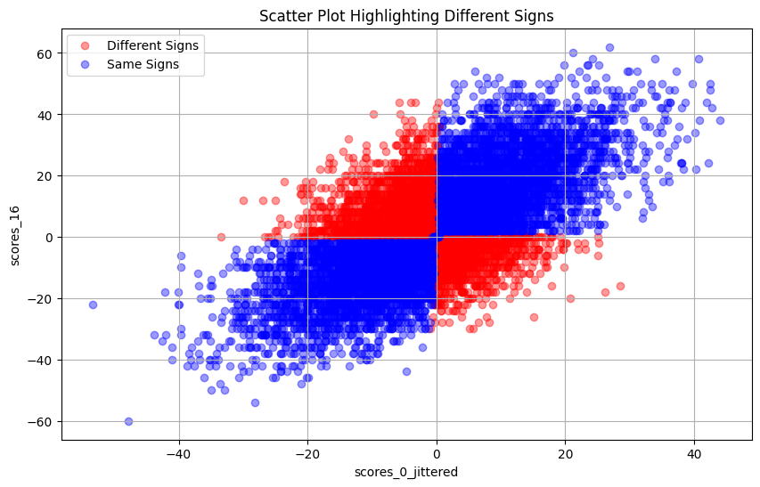

# Othello-Testground
A platform to execute and analyse Othello games between AIs (human included) \
GPL license inherited from [Edax](https://github.com/abulmo/edax-reversi)    
 

TODO: Installation guide
# Dev
Conda env: `conda activate othello_testground` \
Game generation: use edax C code to produce search results in a queue `derived_states`. Python interface should be defined in a central location (currently `bench.py` together with benching tools). \
Eval net training: consume from `derived_states`

## TODO:
1. Output game records
2. Reconstruct games from game records (check edax codebase first)

## C library dev cycle
1. Make code change in .c files, API change in .h files. Put additional APIs in pyutils.h
2. under `/edax_src`, `make build-so`
3. Rerun `main.py` to load the changes
4. Log the changes in pyutils.h for ref

## Optimization Ideas
1. Use mq (kafka) to smooth out game generation and eval net training
2. Organize C library functions into a class so that the library only needs to be load once
3. Use `cython` compilation instead of `ctypes` between python and C code
4. Use [Zobrist Hashing](https://en.wikipedia.org/wiki/Zobrist_hashing) for compact gameboard representation
5. Modify edax to output csv file so loading solution file can be faster with numpy.

## Observations
1. White player seems to have an edge at shallow search depth (<10), while black has an edge for deep search depth, according to self-match results between 2 edax players. White_Edax_8 beats Black_Edax_8 15/0/0, Black_Edax_10 13/2/0, only lose to Black_Edax_11 0/14/1. Black_Edax_15 beats White_Edax_15 15/0/0, White_Edax_18 7/0/8, only lose to White_Edax_20 3/9/3. This might be due to identical openings though.
2. Self match performance: ~0.25s/match for 2 lvl 5 edax players, ~1s/match for 2 lvl 10 edax players
3. Single-process call of random_obf takes 0.5s to generate 10k entries.
4. Multi-process call of random_obf takes 107s for 10M entries
5. Edax takes 5 mins to evaluate 10k positions at level 16 on 8 core i9.
6. Vanilla Google Colab takes ~1s to load and plot 10k entries
7. Edax original eval function fit for randomly generated states as follows, doesn't seem to have optimized against positivity: 
8. 

## Known Issues
1. Sometimes game result has less aggregated games than total games

# Reference
https://github.com/ianlokh/Othello/tree/master
https://github.com/abulmo/edax-reversi

